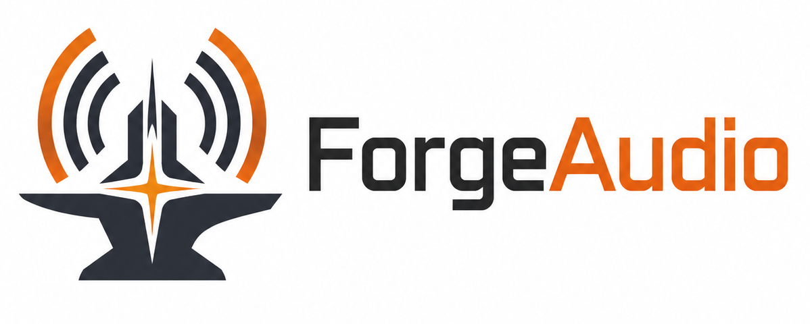

# ForgeAudio

<p align="center">
  
</p>

> Project note: ForgeAudio is in active early development. Large parts of the
> inherited FAudio/XAudio-shaped surface are being removed, renamed, or
> redesigned into ForgeAudio-owned APIs, so the public API should be treated as
> pre-1.0 and subject to change. This README is also temporary and AI-authored;
> it is intended as a working overview and may be revised later for accuracy,
> tone, and completeness.

ForgeAudio is a general-purpose audio runtime for games and interactive
applications.

It began as a fork of [FAudio](https://github.com/FNA-XNA/FAudio), a mature
reimplementation of Microsoft's game-audio runtime APIs. ForgeAudio keeps the
useful low-level foundation from FAudio while moving toward a smaller,
engine-facing design of its own.

The goal is a compact, explicit audio library that can sit underneath a game
engine or custom tool: voices, submixes, channel matrices, effects, spatial
audio, device output, deterministic tests, and enough control to build a
higher-level audio system on top.

## Status

ForgeAudio is an independent audio library derived from FAudio.

Current state:

- The public headers, build targets, symbols, and result types use ForgeAudio
  names and conventions.
- XACT, XNA song support, MSADPCM source support, WMA/XMA public entry points,
  legacy compatibility utilities, generated project files, and inherited
  packaging have been removed.
- The build has been simplified around CMake and C23.
- SDL3 is the default portable backend path, with a native Win32 path available
  behind `PLATFORM_WIN32`.
- Effects, spatial audio, audio batches, format handling, parameter automation,
  and testing APIs are being shaped for ForgeAudio rather than preserved as
  direct FAudio/XAudio surface area.

Upstream FAudio remains useful reference material and a source of fixes, but
compatibility with it or XAudio is not a design goal.

## Features

- Source, submix, and master voices.
- Voice sends, output matrices, and per-send filters.
- Effect chains with ForgeAudio-owned built-in effects.
- Spatial audio helpers.
- Deferred audio batches for synchronized control changes.
- Gain automation for voice volume, channel volume, and output matrices.
- Source-rate target and ramp automation for pitch/resampling changes.
- Typed effect automation for selected reverb, biquad, and delay parameters.
- Target/de-zip APIs for common smoothed gain changes.
- Explicit frame-duration ramps and millisecond convenience ramps.
- Source fade-stop automation for "fade, then stop on the audio timeline."
- Device-backed rendering through platform backends.
- Device-free deterministic render tests under `FORGE_AUDIO_TESTING`.

Built-in effects currently include volume meter, limiter, compressor, delay,
biquad, and reverb processors.

## Documentation

For runtime model details, usage examples, integration notes, mix patterns, and
design comparisons, see [DOCUMENTATION.md](DOCUMENTATION.md).

## Building

ForgeAudio uses CMake 3.20+ and C23.

```sh
cmake -B build -DCMAKE_BUILD_TYPE=Release
cmake --build build
```

Useful options:

| Option | Default | Description |
| --- | --- | --- |
| `BUILD_SHARED_LIBS` | `ON` | Build ForgeAudio as a shared library. |
| `BUILD_TESTS` | `OFF` | Build CTest test executables. |
| `ENABLE_ASAN` | `OFF` | Build with AddressSanitizer when supported by the compiler. |
| `ENABLE_PULSEAUDIO` | `ON` | Enable PulseAudio support in the SDL3 backend path. |
| `ENABLE_WASAPI` | `ON` | Enable WASAPI support in the SDL3 backend path. |
| `PLATFORM_WIN32` | `OFF` | On Windows, use the native Win32 platform path instead of SDL3. |
| `LOG_ASSERTIONS` | `OFF` | Log assertions instead of binding to the platform assert. |
| `FORCE_ENABLE_DEBUGCONFIGURATION` | `OFF` | Enable debug configuration APIs in all build types. |
| `DUMP_VOICES` | `OFF` | Dump source voices to RIFF WAVE files for debugging. |

## Testing

Build tests with `BUILD_TESTS=ON`:

```sh
cmake -B build -DBUILD_TESTS=ON
cmake --build build
ctest --test-dir build --output-on-failure
```

The test suite includes white-box lower-level probes and an engine-level render
harness. The render harness creates a virtual master voice and advances the real
engine processing path synchronously, with no audio device and no wall-clock
dependency. This is used to test batch timing, source rendering, automation,
fade-stop behavior, format validation, and lifecycle failure paths
deterministically.

## Platforms

Currently targeted:

- Windows 10+
- Linux

Other platforms may work over time, but they are not the focus yet.

## Goals

- Stay small enough to understand and embed.
- Keep a practical voice, submix, routing, and effect model for engine audio.
- Make spatial audio, routing, effect processing, automation, and format
  handling explicit.
- Prefer predictable runtime behavior over a large built-in authoring model.
- Add higher-level features when they are justified by real engine use.
- Remain permissively licensed.

## Non-Goals

- ForgeAudio is not an audio authoring suite like FMOD or Wwise.
- It is not a WebAudio-style graph engine by default.
- It is not a dedicated acoustic propagation system like Steam Audio.
- It is not a compatibility layer for another audio API.

## License

ForgeAudio inherits FAudio's permissive zlib-style license. See [LICENSE](LICENSE)
for details.
